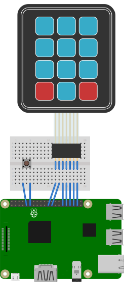

# Reactive Programming with Python on Raspberry Pi

This repo is a demonstration of using RxPy to build an application which responds to physical inputs. It is accompanied by a [blog post](http://www.noumansaleem.com/avr/2018/08/15/reactive-programming-python-raspberry-pi.html).

